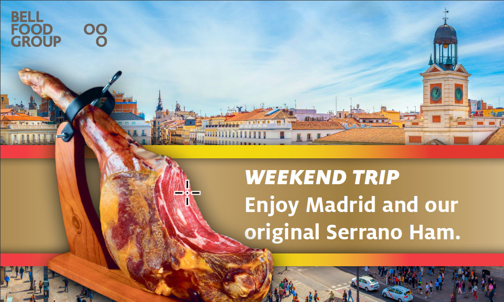
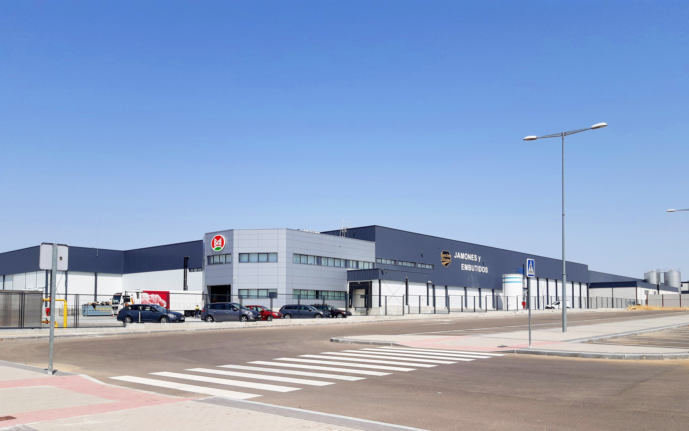

# 
 START Hack 2023 - Bell Food Group Case 

## 
 Case Introduction: 

### Problem
"We take responsibility" is one of the three missions have been defined for the Bell Food Group with which we want to differentiate ourselves as a company. Our employees make important decisions every day to improve sustainability in our company. 
To raise awareness among our employees, we want to develop an app that shows them their "ecological footprint" in a playful way and helps them to record and improve it. As the majority of our workforce does not have access to our company network, an App would be a user-friendly product and it would ensure the possibility to participate all employees. 

### Expected Final Product
Based on different employee profiles (e.g. production workers, sales representatives, truck drivers, managers, ...), employees can manually and automatically record their "ecological footprint" by recording their daily activities. 
For example, the managers or salespersons record their business trips, the production employees specify which activities they perform, how and in which plant, what they consume for lunch in the canteen and how they commute to work. In the factories, we are able to monitor the energy consumption of our production (for each location) through a variety of energy indicators and data points. (such as electricity, water consumption, etc. ).
Ideally, the tracking / collection of this data should be automated wherever possible. In order to determine the most feasible solution, the students` creativity is required.
The goal of this app is to help us bring all these parameters together, show employees their contribution to our sustainability goals, and motivate them to help us achieve them. In order to promote our employees contribution, they should be able to collect "Eco-Points" for their active contributions. Those points for active contributions can be achieved within the areas of environmental and social sustainability (e.g. commute with public transport / bike, regulate temperature in offices, plant trees at a team event, participate in our educational services like training, promote diversity, etc.). Different Dashboards (e.g. individual, location-wide, company-wide, group-wide) Company Data to facilitate the process could be an opportunity to display our employees contribution. It is important to note that the scaling of our employees' sustainability scores should not be dependent on their job group or role (e.g. a butcher has a worse score than an office employee).
Contests (maybe rewards) and gamification aspects convince our employees to use the app on a daily basis.
Overall, creativity is the most important factor when it comes to the development of this solution. Our expectation is the development and creation of a high quality user experience that makes sense, so that people really want to use the platform resp. the app and include it into their "daily business".

## 
 The Pitch: 

 Insert Pitchdeck here 

## 
 Deep Dive Slides: 

 Insert Deep Dive Slides here 

## 
 Further Information: 

Pellentesque vehicula nibh ut metus tempor, id finibus ligula auctor. Vivamus semper dui semper ante condimentum commodo. Sed eget odio ac odio rutrum viverra eget ut dui. Sed scelerisque sem sit amet auctor gravida. Curabitur auctor urna quis lacus tempus luctus. Phasellus dictum erat sit amet nulla commodo egestas. Suspendisse potenti. Duis quis justo ut quam mollis venenatis vel ut ipsum. Integer ornare, neque ut aliquam convallis, odio eros rutrum quam, non pharetra turpis nisl ac arcu. Fusce in nulla tempor, semper nisi eu, sollicitudin est.

##  
 Resources: 

- Lorem ipsum dolor sit amet
- consectetur adipiscing elit

## 
 Judging Criteria: 

Lorem ipsum dolor sit amet, consectetur adipiscing elit. In in sodales turpis. Donec euismod diam sit amet fermentum imperdiet. Donec justo mi, lacinia sed dolor vel, convallis tincidunt ligula. Duis suscipit ante tellus, lacinia venenatis lorem suscipit in. Sed ac ipsum tincidunt, consequat est ut, molestie nunc. Donec efficitur risus ut erat luctus, id congue odio rhoncus. Curabitur neque lorem, maximus at est sit amet, semper vehicula libero. Aliquam a fermentum leo. Mauris rhoncus lorem sed lorem auctor, eu tempus risus ultrices. Proin condimentum sem at commodo congue.

## 
 Point of Contact: 

 Sven, Clara, Maria, Markus, Selina, Anabelle, Christine, Nora and Harry will be glad to answer your questions during the Deep Dive.
We’ll also be available on Discord. 

## 
 Prize - the winning team members will each receive: 

We offer the winning team a long weekend in Madrid including flight and hotel. On Friday you will visit with us our production facility in Fuensalida and taste our fine Spanish specialties. The weekend will be free for you to explore the beautiful city of

  

